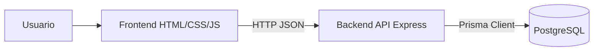
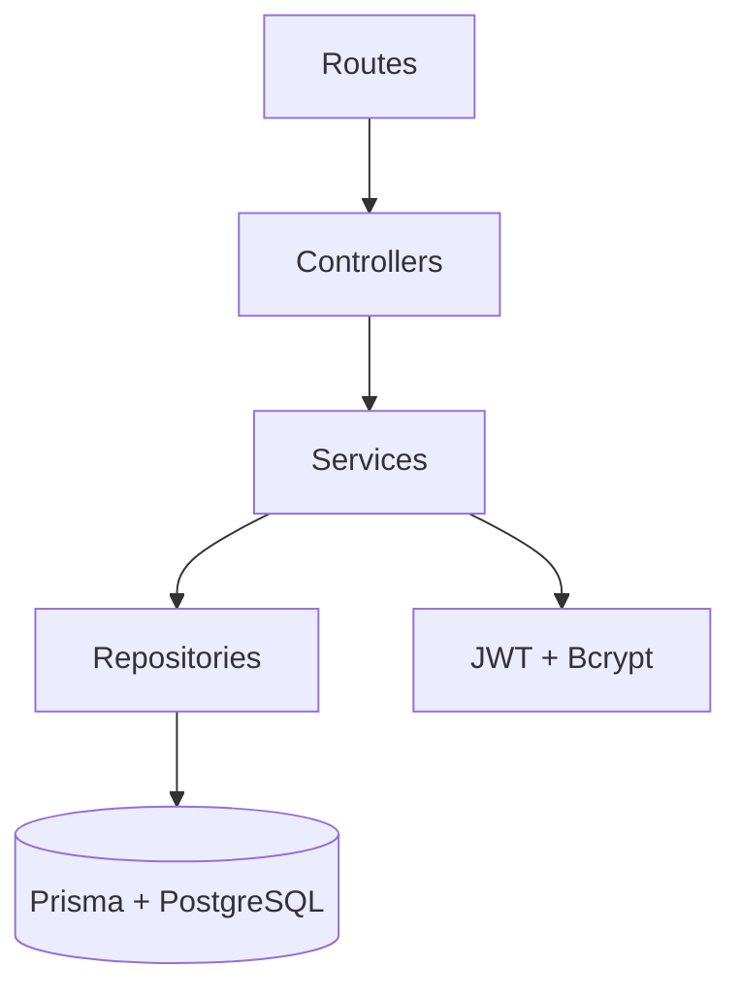
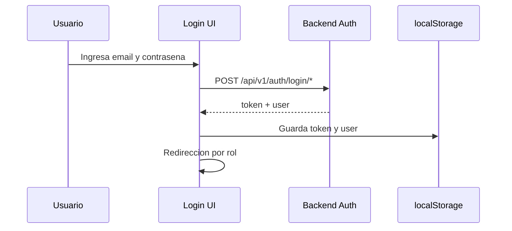
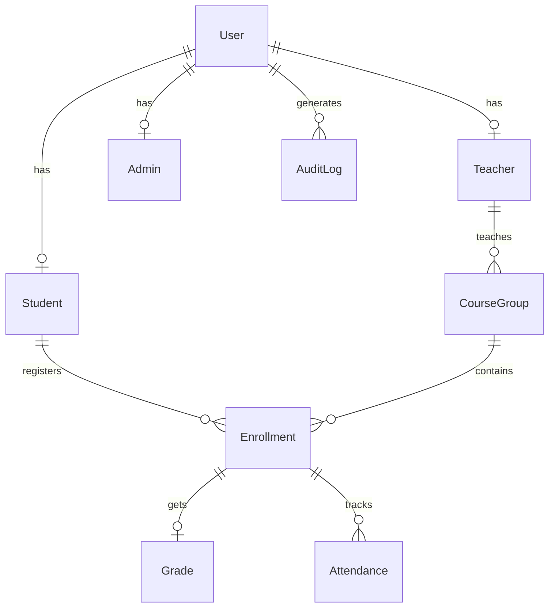

# Unipamplona SIU

Sistema de Informacion Universitaria para la Universidad de Pamplona.

Este repositorio implementa una solucion web completa orientada a procesos academicos y administrativos, con autenticacion por roles y separacion clara entre interfaz, API y persistencia.

## Tabla de contenido

1. [Vision general](#vision-general)
2. [Objetivos funcionales del sistema](#objetivos-funcionales-del-sistema)
3. [Stack tecnologico](#stack-tecnologico)
4. [Arquitectura de alto nivel](#arquitectura-de-alto-nivel)
5. [Estructura del repositorio](#estructura-del-repositorio)
6. [Backend en detalle](#backend-en-detalle)
7. [Frontend en detalle](#frontend-en-detalle)
8. [Modelo de datos en Prisma y PostgreSQL](#modelo-de-datos-en-prisma-y-postgresql)
9. [Instalacion y puesta en marcha (manual)](#instalacion-y-puesta-en-marcha-manual)
10. [Ejecucion automatizada con scripts](#ejecucion-automatizada-con-scripts)
11. [Endpoints principales de la API](#endpoints-principales-de-la-api)
12. [Credenciales de prueba](#credenciales-de-prueba)
13. [Flujos funcionales clave](#flujos-funcionales-clave)
14. [Solucion de problemas comunes](#solucion-de-problemas-comunes)
15. [Buenas practicas para desarrollo](#buenas-practicas-para-desarrollo)
16. [Documentacion complementaria](#documentacion-complementaria)

---

## Vision general

Unipamplona SIU esta organizado como un proyecto por capas:

- `frontend`: interfaz web en HTML/CSS/JavaScript vanilla.
- `backend`: API REST en Node.js + Express.
- `database`: esquema y seed de base de datos en Prisma.
- `docs`: documentacion tecnica adicional (arquitectura, diagramas y API).

El sistema contempla distintos perfiles de usuario:

- `STUDENT`
- `TEACHER`
- `ADMIN`
- `SUPERUSER`

Cada rol consume rutas especificas y tiene vistas personalizadas.

---

## Objetivos funcionales del sistema

El proyecto busca cubrir funciones nucleares de un sistema universitario:

- Autenticacion segura con JWT y control por roles.
- Consulta de paneles de informacion segun perfil.
- Operaciones academicas (grupos, notas, inscripciones, seguimiento).
- Administracion de usuarios y auditoria (perfil superusuario).
- Base de datos relacional normalizada para gestion academica.

---

## Stack tecnologico

### Frontend

- HTML5
- CSS3
- JavaScript ES5/ES6 sin framework
- `fetch` para consumo de API REST
- `localStorage` para sesion local

### Backend

- Node.js 18+
- Express 4
- Prisma ORM 5
- `jsonwebtoken` para tokens JWT
- `bcryptjs` para hash de contrasenas
- `helmet` para cabeceras de seguridad
- `cors` para politicas de origen
- `express-rate-limit` para control de trafico
- `express-validator` para validacion de entrada

### Base de datos

- PostgreSQL 14+
- Esquema Prisma en `database/prisma/schema.prisma`
- Seed inicial en `database/prisma/seed.js`

---

## Arquitectura de alto nivel



### Capas del backend



Responsabilidades principales:

- `presentation/`: gestiona HTTP (rutas, middlewares, controladores).
- `business/`: implementa reglas de negocio y validadores.
- `persistence/`: encapsula operaciones de base de datos.
- `security/`: centraliza autenticacion y hash.
- `config/`: carga y valida configuracion de entorno.

---

## Estructura del repositorio

```text
unipamplona-siu/
|- backend/
|  |- src/
|  |  |- app.js
|  |  |- config/
|  |  |- domain/
|  |  |- security/
|  |  |- persistence/
|  |  |- business/
|  |  |- presentation/
|  |  `- utils/
|  |- .env.example
|  `- package.json
|- frontend/
|  |- index.html
|  `- src/
|     |- assets/
|     |- components/
|     |- layouts/
|     |- pages/
|     |- router/
|     |- services/
|     `- styles/
|- database/
|  `- prisma/
|     |- schema.prisma
|     `- seed.js
|- docs/
|  |- architecture/
|  |- diagrams/
|  `- api/
|- start-all.ps1
`- start-all.bat
```

---

## Backend en detalle

El backend arranca desde `backend/src/app.js` y aplica:

- carga de variables de entorno con `dotenv`,
- protecciones de seguridad con `helmet`,
- reglas `cors` configurables por variable,
- parseo JSON y `urlencoded`,
- rate-limit global y rate-limit especifico para login,
- logging de peticiones,
- ruta de salud (`/health`),
- montaje de rutas versionadas (`/api/v1/*`),
- manejo de errores 404 y excepciones globales.

### Rutas base montadas

- `/api/v1/auth`
- `/api/v1/student`
- `/api/v1/teacher`
- `/api/v1/admin`
- `/api/v1/superuser`

### Seguridad aplicada en tiempo de ejecucion

- JWT obligatorio para endpoints protegidos.
- Autorizacion por rol mediante middlewares.
- Hash de contrasenas con bcrypt.
- Limitacion de solicitudes para mitigar abuso de API.

### Validaciones y errores

Se contemplan errores comunes de forma controlada:

- conflicto de unicos en Prisma (`P2002`),
- registros no encontrados (`P2025`),
- token invalido o expirado,
- errores de validacion (422) en formularios y payloads.

---

## Frontend en detalle

La capa cliente usa JavaScript vanilla y esta orientada por modulos.

### Archivos clave

- `frontend/index.html`: pagina principal.
- `frontend/src/services/services.js`:
  - configuracion global (`API_BASE`, llaves de sesion),
  - cliente HTTP (`GET/POST/PUT/PATCH/DELETE`),
  - servicio de autenticacion,
  - helper de endpoints API,
  - sistema de notificaciones (toast),
  - widget de login.
- `frontend/src/router/router.js`:
  - mapeo de vistas por rol,
  - guardas de navegacion,
  - redireccion al dashboard correspondiente.
- `frontend/src/pages/**`: vistas por modulo y rol.

### Flujo de autenticacion desde UI



### Nota importante sobre alineacion Frontend/Backend

En `services.js` existen helpers de API para endpoints que pueden no estar implementados todavia en las rutas actuales del backend. Esto puede ser intencional (trabajo en progreso), pero conviene validar cada integracion antes de usarla en produccion.

---

## Modelo de datos en Prisma y PostgreSQL

Fuente de verdad: `database/prisma/schema.prisma`.

### Enums definidos

- `Role`
- `UserStatus`
- `EnrollmentStatus`
- `AttendanceStatus`
- `DayOfWeek`
- `SemesterType`
- `RequestStatus`

### Modelos principales

Identidad y perfiles:

- `User`
- `Student`
- `Teacher`
- `Admin`

Estructura academica:

- `Faculty`
- `Department`
- `Program`
- `Course`
- `ProgramCourse`
- `AcademicPeriod`
- `Building`
- `Classroom`
- `CourseGroup`
- `Schedule`

Seguimiento academico:

- `Enrollment`
- `Grade`
- `Attendance`

Servicios y trazabilidad:

- `Announcement`
- `PQRS`
- `Certificate`
- `AuditLog`

### Relacion conceptual simplificada



---

## Instalacion y puesta en marcha (manual)

## 1) Requisitos previos

- Node.js 18 o superior
- npm 9 o superior
- PostgreSQL 14 o superior
- Python (opcional, para servidor estatico del frontend con `py -m http.server`)

## 2) Clonar repositorio

```bash
git clone <url-del-repo>
cd unipamplona-siu
```

## 3) Configurar backend

```bash
cd backend
npm install
```

Crear archivo de entorno:

```bash
cp .env.example .env
```

Editar `backend/.env` y ajustar como minimo:

- `DATABASE_URL`
- `JWT_SECRET`
- `PORT` (por defecto `3000`)
- `CORS_ORIGIN` (por defecto `http://localhost:5500`)
- `JWT_EXPIRES_IN` (por defecto `8h`)
- `RATE_LIMIT_WINDOW_MS`
- `RATE_LIMIT_MAX`
- `BCRYPT_ROUNDS`

## 4) Preparar Prisma y base de datos

Desde `backend/`:

```bash
npx prisma generate --schema ../database/prisma/schema.prisma
```

Si necesitas crear tablas por primera vez:

```bash
npx prisma migrate dev --name init --schema ../database/prisma/schema.prisma
```

Si deseas cargar datos semilla:

```bash
node ../database/prisma/seed.js
```

## 5) Levantar backend

```bash
npm run dev
```

API disponible en:

- `http://localhost:3000`
- `http://localhost:3000/health`
- `http://localhost:3000/api/v1/*`

## 6) Levantar frontend

En otra terminal:

```bash
cd frontend
py -m http.server 5500
```

Abrir en navegador:

- Frontend: `http://localhost:5500`
- Health API: `http://localhost:3000/health`

---

## Ejecucion automatizada con scripts

El proyecto incluye dos scripts para simplificar el arranque en Windows:

- `start-all.ps1`
- `start-all.bat`

### Opcion recomendada

Desde la raiz:

```powershell
.\start-all.bat
```

O ejecucion directa del script PowerShell:

```powershell
powershell -ExecutionPolicy Bypass -File .\start-all.ps1
```

### Que hace automaticamente `start-all.ps1`

1. Valida estructura de proyecto (`backend` y `frontend`).
2. Crea `backend/.env` desde `.env.example` si no existe.
3. Verifica presencia del schema Prisma en `database/prisma/schema.prisma`.
4. Instala dependencias de backend si falta `node_modules`.
5. Genera Prisma Client apuntando al schema correcto.
6. Abre dos terminales nuevas:
   - backend (`npm run dev`)
   - frontend (`py -m http.server 5500`)

### Parametro opcional

Si no quieres revisar/instalar dependencias:

```powershell
.\start-all.ps1 -SkipInstall
```

---

## Endpoints principales de la API

Base URL: `http://localhost:3000/api/v1`

### Auth

- `POST /auth/login/student`
- `POST /auth/login/admin`
- `POST /auth/logout` (requiere token)
- `GET /auth/me` (requiere token)

### Student (rol `STUDENT`)

- `GET /student/dashboard`
- `GET /student/schedule`
- `GET /student/grades`
- `GET /student/profile`
- `GET /student/announcements`

### Teacher (roles `TEACHER`, `ADMIN`)

- `GET /teacher/dashboard`
- `GET /teacher/groups`
- `GET /teacher/groups/:id/students`
- `PATCH /teacher/grades/:id`

### Admin (roles `ADMIN`, `SUPERUSER`)

- `GET /admin/dashboard`
- `GET /admin/students`
- `GET /admin/teachers`
- `GET /admin/course-groups`

### Superuser (rol `SUPERUSER`)

- `GET /superuser/dashboard`
- `GET /superuser/users`
- `GET /superuser/users/:id`
- `POST /superuser/users`
- `PUT /superuser/users/:id`
- `DELETE /superuser/users/:id`
- `PATCH /superuser/users/:id/toggle-status`
- `GET /superuser/audit-logs`

### Sistema

- `GET /health` (sin autenticacion)

---

## Credenciales de prueba

Las credenciales seed y usuarios de ejemplo estan documentadas en:

- `docs/README.md`

Si ejecutas seed inicial en una base nueva, usa esas cuentas para probar cada rol.

---

## Flujos funcionales clave

### Inicio de sesion

1. Usuario envia correo y contrasena.
2. API valida rol permitido segun endpoint (`student` o `admin`).
3. Se verifica estado de cuenta y password hash.
4. Se genera JWT.
5. Frontend guarda token y usuario en `localStorage`.
6. Router redirige al dashboard del rol.

### Cierre de sesion

1. Frontend invoca `POST /auth/logout`.
2. Backend registra auditoria de logout.
3. Cliente elimina token y usuario local.
4. Navegador regresa al `index.html`.

### Navegacion protegida

1. Router detecta ruta actual.
2. Verifica sesion activa.
3. Compara rol del usuario con roles permitidos de la ruta.
4. Si no cumple, redirige al home correspondiente.

---

## Solucion de problemas comunes

### 1) Puerto ocupado (`3000` o `5500`)

- Cierra procesos previos que usen el puerto.
- O cambia puertos en `backend/.env` y en la forma de servir frontend.

### 2) Error de conexion a PostgreSQL

Revisa en `backend/.env`:

- host, puerto, usuario y contrasena,
- nombre de base de datos,
- parametro `schema=public` si aplica.

### 3) Prisma no encuentra el schema

Asegura que el comando incluya:

- `--schema ../database/prisma/schema.prisma` (cuando ejecutas desde `backend/`).

### 4) Error CORS en navegador

- Verifica `CORS_ORIGIN` en `.env`.
- Confirma que frontend se abre desde el origen permitido.

### 5) JWT invalido o expirado

- Vuelve a iniciar sesion.
- Si persiste, limpia `localStorage` del navegador.

### 6) Rate limit alcanzado

- Espera la ventana de tiempo configurada.
- Ajusta `RATE_LIMIT_WINDOW_MS` y `RATE_LIMIT_MAX` solo en entornos de desarrollo.

---

## Buenas practicas para desarrollo

- No subir nunca archivos `.env` ni secretos.
- Mantener sincronia entre:
  - rutas backend reales,
  - helper de endpoints en frontend,
  - documentacion en `docs/api`.
- Antes de commits, validar:
  - que backend arranque,
  - que frontend cargue,
  - que login por cada rol responda correctamente.
- Usar nombres y convenciones consistentes para roles y rutas.
- Registrar cambios de API tambien en documentacion tecnica.

---

## Documentacion complementaria

Para mayor nivel de detalle, revisar:

- `docs/README.md`
- `docs/api/api-spec.md`
- `docs/diagrams/routes-map.md`
- `docs/diagrams/er-diagram.md`
- `docs/architecture/layers-diagram.md`
- `docs/architecture/folder-diagram.md`
- `docs/architecture/flow-diagram.md`

---

## Estado del proyecto

Proyecto funcional para entorno local con separacion clara por capas y roles.

Ideal para:

- practicas academicas de arquitectura backend/frontend,
- demostraciones de SIU con control de acceso por perfil,
- evolucion hacia una version productiva con hardening adicional.

